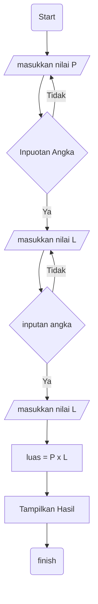

```mermaid
    flowchart TD;

    A(Start) --> B[/masukkan nilai P/];
    B --> C{Inpuotan Angka}
    C -- Tidak --> B
    C -- Ya -->D[/masukkan nilai L/];
    D --> E{inputan angka}
    E -- Tidak --> D
    E -- Ya -->F[/masukkan nilai L/];
    F --> G[luas = P x L];
    G --> I[Tampilkan Hasil];
    I --> J(finish);
```
